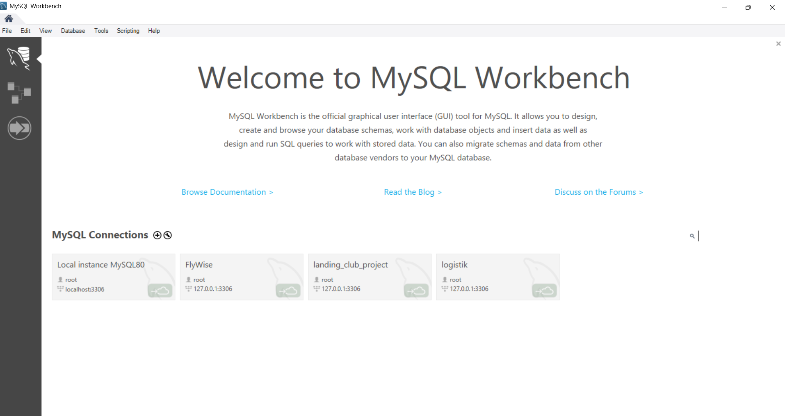
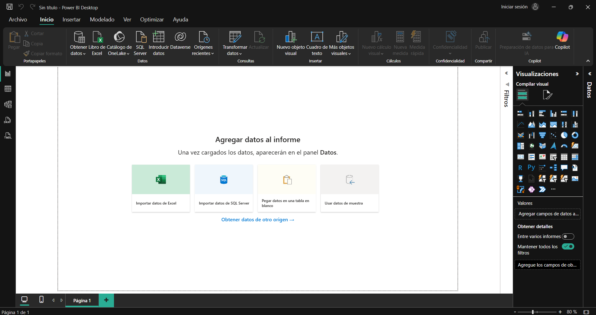

# Setup Evidence — Maximiliano G. Coceres

## Versiones instaladas

| Herramienta | Versión             |
| ----------- | ------------------- |
| MySQL       | 8.0.45              |
| Power BI    | 2.151.1182.0 64-bit |
| Git         | 2.31.1.windows.1    |
| GitHub CLI  | 2.92.0 (2026-04-28) |

### MySQL Workbench

### Power BI

## Configuración de GIT

git config --global user.name Maximiliano G. Coceres

git config --global user.email maximiliano.g.coceres@gmail.com

## Configuración Github CLI autenticado

gh auth status github.com ✓ Logged in to github.com account maxicoceres-data (keyring)

- Active account: true
- Git operations protocol: https
- Token: gho\_****************\*\*\*\*****************
- Token scopes: 'gist', 'read:org', 'repo', 'workflow'
